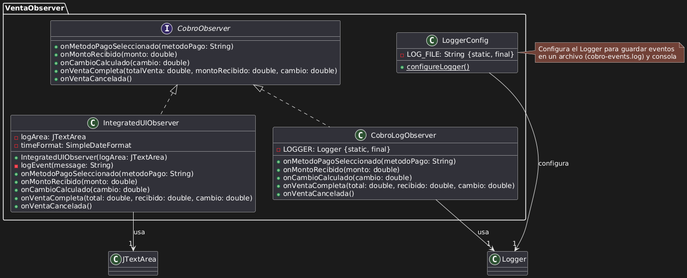

# Patrón Observer en el Sistema de Cobro
## Introducción al Patrón Observer
El patrón Observer implementado en el sistema de cobro establece un mecanismo de notificación donde los objetos (observadores) son informados automáticamente sobre cambios de estado en otro objeto (sujeto). Esta implementación permite monitorear en tiempo real el proceso de cobro, tanto para fines de desarrollo como para mejorar la experiencia del usuario final.

## Componentes Principales
### Interfaz CobroObserver
Se creó la interfaz `CobroObserver` que define los métodos que deben implementar todos los observadores:

``` java
public interface CobroObserver {
    void onMetodoPagoSeleccionado(String metodoPago);
    void onMontoRecibido(double monto);
    void onCambioCalculado(double cambio);
    void onVentaCompleta(double total, double recibido, double cambio);
    void onVentaCancelada();
}
```

### Clase Sujeto (Cobro)
La clase `Cobro` se modificó para actuar como sujeto observable:
``` java
private ArrayList<CobroObserver> observers = new ArrayList<>();

public void addObserver(CobroObserver observer) {
    observers.add(observer);
}

public void removeObserver(CobroObserver observer) {
    observers.remove(observer);
}
```

### Métodos de Notificación
Se implementaron métodos específicos en la clase `Cobro` para notificar a los observadores sobre diferentes eventos:
```java
private void notifyMetodoPagoSeleccionado(String metodoPago) {...}
private void notifyMontoRecibido(double monto) {...}
private void notifyCambioCalculado(double cambio) {...}
private void notifyVentaCompleta(double totalVenta, double montoRecibido, double cambio) {...}
private void notifyVentaCancelada() {...}
```

### Observadores Concretos
Se implementaron dos tipos de observadores:

CobroLogObserver: Registra eventos en el archivo de log
UICobroObserver: Muestra eventos en una ventana gráfica
IntegratedUIObserver: Muestra eventos dentro de la interfaz de cobro

## Sistema de Logging
### Configuración del Logger
Se creó la clase `LoggerConfig` para configurar el sistema de logging:
``` java
public static void configureLogger() {
    // Crear directorio de logs
    File logDir = new File("logs");
    if (!logDir.exists()) {
        logDir.mkdir();
    }
    
    // Configurar logger
    Logger rootLogger = Logger.getLogger("");
    rootLogger.setLevel(Level.INFO);
    
    // Handlers para consola y archivo
    ConsoleHandler consoleHandler = new ConsoleHandler();
    FileHandler fileHandler = new FileHandler(LOG_FILE, true);
    // ...
}
```

### Integración de Logging
Los métodos de notificación utilizan el logger para registrar eventos:
``` java
LOGGER.log(Level.INFO, "Notificando método de pago: {0}", metodoPago);
```

## Visualización de Eventos
### Ventana de Monitoreo
Se implementó una ventana independiente para mostrar los eventos en tiempo real:
``` java
JFrame eventFrame = new JFrame("Monitor de Eventos - Patrón Observer");
JTextArea areaEventos = new JTextArea(15, 40);
areaEventos.setEditable(false);
JScrollPane scrollPane = new JScrollPane(areaEventos);
eventFrame.add(scrollPane);
eventFrame.pack();
eventFrame.setLocation(this.getLocation().x + this.getWidth() + 10, this.getLocation().y);
eventFrame.setVisible(true);

addObserver(new VentaObserver.IntegratedUIObserver(areaEventos));
```

### Ciclo de Vida de la Ventana
La ventana de monitoreo se cierra automáticamente cuando se cierra la ventana principal:
``` java 
this.addWindowListener(new WindowAdapter() {
    @Override
    public void windowClosing(WindowEvent e) {
        eventFrame.dispose();
    }
    
    public void windowClosed(WindowEvent e) {
        eventFrame.dispose();
    }
});
```

## Registro de Puntos de Observación
Se implementaron puntos de notificación en las siguientes acciones:

### Selección de Método de Pago
``` java
public void setMetodoPago(MetodoPago metodoPago) {
    this.metodoPago = metodoPago;
    System.out.println("Notificando a " + observers.size() + " observadores sobre método de pago...");
    notifyMetodoPagoSeleccionado(metodoPago.getClass().getSimpleName());
}
```
### Cálculo de Cambio
``` java
private void calcularCambio() {
    try {
        double montoRecibido = Double.parseDouble(recibi.getText());
        System.out.println("Notificando a " + observers.size() + " observadores sobre método de pago...");
        notifyMontoRecibido(montoRecibido);
        // ...
    }
    // ...
}
```
### Completar Venta
``` java
if (flag) {
    System.out.println("Notificando a " + observers.size() + " observadores sobre método de pago...");
    notifyVentaCompleta(pago, pago, pago);
    // ...
}
```
### Cancelar Venta
``` java
private void jButton4ActionPerformed(java.awt.event.ActionEvent evt) {
    System.out.println("Notificando a " + observers.size() + " observadores sobre método de pago...");
    notifyVentaCancelada();
    dispose();
}
```
## Integración en el Sistema

### Inicialización del Logger
El sistema de logging se inicializa en el constructor de `Cobro` y en el método `main`:
``` java
public Cobro() {
    VentaObserver.LoggerConfig.configureLogger();
    
    File logFile = new File("logs/cobro-events.log");
    if (logFile.exists()) {
        System.out.println("Archivo de log creado en " + logFile.getAbsolutePath());
    } else {
        System.out.println("No se pudo crear el archivo de log.");
    }
    
    // ...
}
```

### Registro de Observadores
Se registran múltiples observadores en el constructor de Cobro:
``` java
addObserver(new VentaObserver.CobroLogObserver());
addObserver(new VentaObserver.UICobroObserver());
// ...
addObserver(new VentaObserver.IntegratedUIObserver(areaEventos));
```
## Beneficios de la Implementación
Desacoplamiento: Separa la lógica de cobro de la lógica de monitoreo
Extensibilidad: Facilita añadir nuevos tipos de observadores sin modificar la clase `Cobro`
Transparencia: Proporciona visibilidad de los procesos internos, beneficiando tanto a desarrolladores como a usuarios finales
Depuración mejorada: Facilita la detección y resolución de problemas
Auditoría: Proporciona un registro detallado de las operaciones realizadas
## Ubicación de Archivos de Log
Los logs se almacenan en:

Ubicación: `cobro-events.log`
Formato: Texto plano con registros de fecha, hora y mensaje
Persistencia: Mantiene historial entre ejecuciones (append mode)

## Diagrama UML

