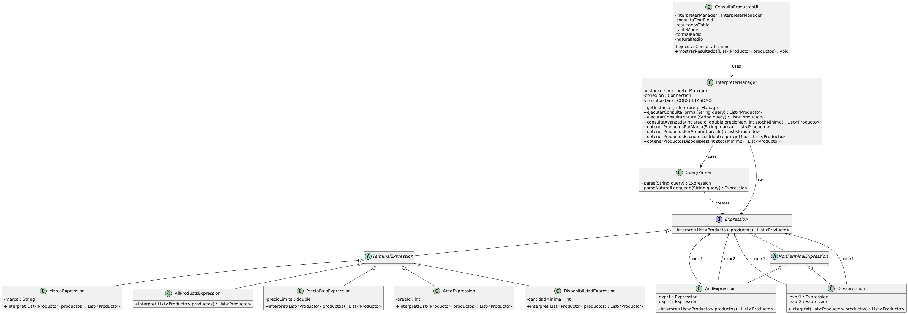

# Patrón Interpreter - Tienda de Abarrotes

## Índice
1. [Introducción](#introducción)
2. [Diagrama UML](#diagrama-uml)
3. [Estructura del Patrón](#estructura-del-patrón)
4. [Implementación](#implementación)
5. [Código Completo](#código-completo)
6. [Ejemplos de Uso](#ejemplos-de-uso)
7. [Beneficios y Consideraciones](#beneficios-y-consideraciones)

## Introducción

El **patrón Interpreter** es un patrón de diseño conductual que define una representación para su gramática junto con un intérprete que usa esta representación para interpretar sentencias en el lenguaje.

En el contexto de la Tienda de Abarrotes, este patrón se utiliza para implementar un sistema flexible de consultas de productos que permite:

- Filtrar productos por diferentes criterios (precio, área, disponibilidad, marca)
- Combinar estos criterios usando operaciones lógicas (AND, OR)
- Interpretar consultas en formato formal (precio < 100 AND area = 2) o en lenguaje natural ("productos baratos de marca Bimbo")

## Diagrama UML




## Estructura del Patrón

La estructura del patrón Interpreter en nuestra implementación consta de:

1. **Expression (Interfaz)**: Define el método `interpret()` que todas las expresiones deben implementar.

2. **Expresiones Terminales**:
   - **PrecioBajoExpression**: Filtra productos con precio menor a un valor especificado
   - **AreaExpression**: Filtra productos por área
   - **DisponibilidadExpression**: Filtra productos con disponibilidad mayor a un valor
   - **MarcaExpression**: Filtra productos por marca
   - **AllProductsExpression**: Devuelve todos los productos (caso base)

3. **Expresiones No Terminales**:
   - **AndExpression**: Combina dos expresiones con operación lógica AND
   - **OrExpression**: Combina dos expresiones con operación lógica OR

4. **Clases de Soporte**:
   - **QueryParser**: Convierte texto en expresiones
   - **InterpreterManager**: Gestiona el patrón Interpreter (Singleton)
   - **ConsultaProductosUI**: Interfaz gráfica para demostrar el uso del patrón

## Implementación

### Paso 1: Crear la Interfaz Expression

La interfaz `Expression` define el método `interpret()` que recibe una lista de productos y devuelve una lista filtrada según la expresión.

```java
package PatronInterpreter;

import DBObjetos.Producto;
import java.util.List;

/**
 * Interfaz base para el patrón Interpreter.
 * Todas las expresiones interpretables deben implementar esta interfaz.
 */
public interface Expression {
    /**
     * Interpreta la expresión y devuelve una lista de productos que cumplen con la condición.
     * @param productos Lista de productos sobre la que se aplica la interpretación
     * @return Lista de productos filtrados según la expresión
     */
    List<Producto> interpret(List<Producto> productos);
}
```

### Paso 2: Implementar Expresiones Terminales

Las expresiones terminales representan las reglas básicas que no pueden descomponerse más.

**PrecioBajoExpression**: Filtra productos con precio menor a un límite
```java
package PatronInterpreter;

import DBObjetos.Producto;
import java.util.List;
import java.util.stream.Collectors;

/**
 * Expresión terminal para filtrar productos con precio menor a un valor específico.
 */
public class PrecioBajoExpression implements Expression {
    private double precioLimite;
    
    public PrecioBajoExpression(double precioLimite) {
        this.precioLimite = precioLimite;
    }
    
    @Override
    public List<Producto> interpret(List<Producto> productos) {
        return productos.stream()
                .filter(p -> p.getPrecio() < precioLimite)
                .collect(Collectors.toList());
    }
}
```

**AreaExpression**: Filtra productos por área
```java
package PatronInterpreter;

import DBObjetos.Producto;
import java.util.List;
import java.util.stream.Collectors;

/**
 * Expresión terminal para filtrar productos por área.
 */
public class AreaExpression implements Expression {
    private int areaId;
    
    public AreaExpression(int areaId) {
        this.areaId = areaId;
    }
    
    @Override
    public List<Producto> interpret(List<Producto> productos) {
        return productos.stream()
                .filter(p -> p.getAreaID() == areaId)
                .collect(Collectors.toList());
    }
}
```

**DisponibilidadExpression**: Filtra productos con disponibilidad mayor a un valor
```java
package PatronInterpreter;

import DBObjetos.Producto;
import java.util.List;
import java.util.stream.Collectors;

/**
 * Expresión terminal para filtrar productos con disponibilidad mayor a un valor.
 */
public class DisponibilidadExpression implements Expression {
    private int cantidadMinima;
    
    public DisponibilidadExpression(int cantidadMinima) {
        this.cantidadMinima = cantidadMinima;
    }
    
    @Override
    public List<Producto> interpret(List<Producto> productos) {
        return productos.stream()
                .filter(p -> p.getUnidadesDisponibles() > cantidadMinima)
                .collect(Collectors.toList());
    }
}
```

**MarcaExpression**: Filtra productos por marca
```java
package PatronInterpreter;

import DBObjetos.Producto;
import java.util.List;
import java.util.stream.Collectors;

/**
 * Expresión terminal para filtrar productos por marca.
 */
public class MarcaExpression implements Expression {
    private String marca;
    
    public MarcaExpression(String marca) {
        this.marca = marca;
    }
    
    @Override
    public List<Producto> interpret(List<Producto> productos) {
        return productos.stream()
                .filter(p -> p.getMarca() != null && p.getMarca().equalsIgnoreCase(marca))
                .collect(Collectors.toList());
    }
}
```

**AllProductsExpression**: Devuelve todos los productos sin filtrar
```java
package PatronInterpreter;

import DBObjetos.Producto;
import java.util.List;

/**
 * Expresión que devuelve todos los productos sin aplicar filtros.
 * Útil como caso por defecto o cuando una consulta no contiene condiciones.
 */
public class AllProductsExpression implements Expression {
    
    @Override
    public List<Producto> interpret(List<Producto> productos) {
        return productos; // Devuelve la lista sin modificar
    }
}
```

### Paso 3: Implementar Expresiones No Terminales

Las expresiones no terminales combinan otras expresiones para formar reglas complejas.

**AndExpression**: Combina dos expresiones con operación lógica AND
```java
package PatronInterpreter;

import DBObjetos.Producto;
import java.util.List;

/**
 * Expresión no terminal que representa la operación lógica AND entre dos expresiones.
 */
public class AndExpression implements Expression {
    private Expression expr1;
    private Expression expr2;
    
    public AndExpression(Expression expr1, Expression expr2) {
        this.expr1 = expr1;
        this.expr2 = expr2;
    }
    
    @Override
    public List<Producto> interpret(List<Producto> productos) {
        List<Producto> primerResultado = expr1.interpret(productos);
        return expr2.interpret(primerResultado);
    }
}
```

**OrExpression**: Combina dos expresiones con operación lógica OR
```java
package PatronInterpreter;

import DBObjetos.Producto;
import java.util.ArrayList;
import java.util.HashSet;
import java.util.List;
import java.util.Set;

/**
 * Expresión no terminal que representa la operación lógica OR entre dos expresiones.
 */
public class OrExpression implements Expression {
    private Expression expr1;
    private Expression expr2;
    
    public OrExpression(Expression expr1, Expression expr2) {
        this.expr1 = expr1;
        this.expr2 = expr2;
    }
    
    @Override
    public List<Producto> interpret(List<Producto> productos) {
        List<Producto> primerResultado = expr1.interpret(productos);
        List<Producto> segundoResultado = expr2.interpret(productos);
        
        // Combinar los resultados sin duplicados
        Set<Producto> resultadoTotal = new HashSet<>(primerResultado);
        resultadoTotal.addAll(segundoResultado);
        
        return new ArrayList<>(resultadoTotal);
    }
}
```

### Paso 4: Implementar el Parser de Consultas

El `QueryParser` analiza las consultas de texto y las convierte en expresiones interpretables.

```java
package PatronInterpreter;

import java.util.HashMap;
import java.util.Map;
import java.util.regex.Matcher;
import java.util.regex.Pattern;

/**
 * Parseador de consultas que convierte texto en expresiones interpretables.
 */
public class QueryParser {
    // Patrones para reconocer distintas partes de la consulta
    private static final Pattern PRECIO_PATTERN = Pattern.compile("precio\\s*<\\s*(\\d+(\\.\\d+)?)");
    private static final Pattern AREA_PATTERN = Pattern.compile("area\\s*=\\s*(\\d+)");
    private static final Pattern DISPONIBILIDAD_PATTERN = Pattern.compile("disponible\\s*>\\s*(\\d+)");
    private static final Pattern MARCA_PATTERN = Pattern.compile("marca\\s*=\\s*\"([^\"]+)\"");
    
    /**
     * Parsea una consulta en texto y devuelve la expresión correspondiente.
     * 
     * @param query Texto de la consulta (ej: "precio < 50 AND area = 2")
     * @return Expression que representa la consulta
     */
    public static Expression parse(String query) {
        query = query.toLowerCase().trim();
        
        // Si la consulta contiene AND u OR, separarla y procesarla
        if (query.contains(" and ")) {
            String[] parts = query.split(" and ", 2);
            return new AndExpression(parse(parts[0]), parse(parts[1]));
        } else if (query.contains(" or ")) {
            String[] parts = query.split(" or ", 2);
            return new OrExpression(parse(parts[0]), parse(parts[1]));
        }
        
        // Procesar expresiones simples
        Matcher precieMatcher = PRECIO_PATTERN.matcher(query);
        if (precieMatcher.find()) {
            double precio = Double.parseDouble(precieMatcher.group(1));
            return new PrecioBajoExpression(precio);
        }
        
        Matcher areaMatcher = AREA_PATTERN.matcher(query);
        if (areaMatcher.find()) {
            int areaId = Integer.parseInt(areaMatcher.group(1));
            return new AreaExpression(areaId);
        }
        
        Matcher dispMatcher = DISPONIBILIDAD_PATTERN.matcher(query);
        if (dispMatcher.find()) {
            int cantidad = Integer.parseInt(dispMatcher.group(1));
            return new DisponibilidadExpression(cantidad);
        }
        
        Matcher marcaMatcher = MARCA_PATTERN.matcher(query);
        if (marcaMatcher.find()) {
            String marca = marcaMatcher.group(1);
            return new MarcaExpression(marca);
        }
        
        throw new IllegalArgumentException("No se pudo interpretar la consulta: " + query);
    }
    
    /**
     * Parsea una consulta en lenguaje natural más amigable.
     * 
     * @param query Consulta en lenguaje natural (ej: "productos baratos de la marca Bimbo")
     * @return Expression que representa la consulta
     */
    public static Expression parseNaturalLanguage(String query) {
        query = query.toLowerCase().trim();
        
        Map<String, Expression> expressions = new HashMap<>();
        
        // Detectar patrones de lenguaje natural
        if (query.contains("barato") || query.contains("económico")) {
            expressions.put("precio", new PrecioBajoExpression(50.0)); // Define tu umbral de "barato"
        }
        
        if (query.contains("bebidas") || query.contains("refrescos")) {
            expressions.put("area", new AreaExpression(1)); // Asume que el área 1 es bebidas
        } else if (query.contains("alimentos") || query.contains("comida")) {
            expressions.put("area", new AreaExpression(2)); // Asume que el área 2 es alimentos
        }
        
        // Detectar marca
        Pattern marcaPattern = Pattern.compile("marca\\s+([a-zA-Z0-9]+)");
        Matcher marcaMatcher = marcaPattern.matcher(query);
        if (marcaMatcher.find()) {
            expressions.put("marca", new MarcaExpression(marcaMatcher.group(1)));
        }
        
        // Combinar expresiones con AND
        Expression resultExpr = null;
        for (Expression expr : expressions.values()) {
            if (resultExpr == null) {
                resultExpr = expr;
            } else {
                resultExpr = new AndExpression(resultExpr, expr);
            }
        }
        
        return resultExpr != null ? resultExpr : new AllProductsExpression();
    }
}
```

### Paso 5: Crear el InterpreterManager

El `InterpreterManager` actúa como fachada para el sistema de interpretación de consultas.

```java
package PatronInterpreter;

import ConexionDB.Conexion_DB;
import Consultas.CONSULTASDAO;
import DBObjetos.Producto;
import java.sql.Connection;
import java.sql.SQLException;
import java.util.ArrayList;
import java.util.List;
import javax.swing.JOptionPane;

/**
 * Clase principal que gestiona el patrón Interpreter.
 * Esta clase sirve como fachada para el sistema de interpreterión de consultas.
 */
public class InterpreterManager {
    
    private static InterpreterManager instance;
    private Connection conexion;
    private CONSULTASDAO consultasDao;
    
    /**
     * Constructor privado para Singleton
     */
    private InterpreterManager() {
        try {
            conexion = Conexion_DB.getConexion();
            consultasDao = new CONSULTASDAO(conexion);
        } catch (SQLException e) {
            JOptionPane.showMessageDialog(null, 
                    "Error al inicializar el Interpreter Manager: " + e.getMessage(), 
                    "Error", JOptionPane.ERROR_MESSAGE);
            e.printStackTrace();
        }
    }
    
    /**
     * Obtener la instancia única de InterpreterManager (patrón Singleton)
     */
    public static synchronized InterpreterManager getInstance() {
        if (instance == null) {
            instance = new InterpreterManager();
        }
        return instance;
    }
    
    /**
     * Ejecuta una consulta formal con sintaxis específica
     * 
     * @param query Consulta en formato específico (ej: "precio < 100 AND area = 2")
     * @return Lista de productos que cumplen la consulta
     */
    public List<Producto> ejecutarConsultaFormal(String query) {
        try {
            List<Producto> productos = consultasDao.obtenerProductosConNombreArea();
            Expression expresion = QueryParser.parse(query);
            return expresion.interpret(productos);
        } catch (Exception e) {
            JOptionPane.showMessageDialog(null, 
                    "Error al ejecutar la consulta formal: " + e.getMessage(), 
                    "Error", JOptionPane.ERROR_MESSAGE);
            e.printStackTrace();
            return new ArrayList<>();
        }
    }
    
    /**
     * Ejecuta una consulta en lenguaje natural 
     * 
     * @param query Consulta en lenguaje natural (ej: "productos baratos de la marca Bimbo")
     * @return Lista de productos que cumplen la consulta
     */
    public List<Producto> ejecutarConsultaNatural(String query) {
        try {
            List<Producto> productos = consultasDao.obtenerProductosConNombreArea();
            Expression expresion = QueryParser.parseNaturalLanguage(query);
            return expresion.interpret(productos);
        } catch (Exception e) {
            JOptionPane.showMessageDialog(null, 
                    "Error al ejecutar la consulta natural: " + e.getMessage(), 
                    "Error", JOptionPane.ERROR_MESSAGE);
            e.printStackTrace();
            return new ArrayList<>();
        }
    }
    
    /**
     * Crea una consulta programática con criterios específicos
     * 
     * @param areaId ID del área
     * @param precioMax Precio máximo
     * @param stockMinimo Stock mínimo
     * @return Lista de productos que cumplen con todos los criterios
     */
    public List<Producto> consultaAvanzada(int areaId, double precioMax, int stockMinimo) {
        try {
            List<Producto> productos = consultasDao.obtenerProductosConNombreArea();
            
            Expression areaExpr = new AreaExpression(areaId);
            Expression precioExpr = new PrecioBajoExpression(precioMax);
            Expression stockExpr = new DisponibilidadExpression(stockMinimo - 1);
            
            Expression consultaCompleta = new AndExpression(
                    areaExpr, 
                    new AndExpression(precioExpr, stockExpr)
            );
            
            return consultaCompleta.interpret(productos);
        } catch (Exception e) {
            JOptionPane.showMessageDialog(null, 
                    "Error al ejecutar la consulta avanzada: " + e.getMessage(), 
                    "Error", JOptionPane.ERROR_MESSAGE);
            e.printStackTrace();
            return new ArrayList<>();
        }
    }
    
    /**
     * Obtiene productos por marca
     * 
     * @param marca Nombre de la marca
     * @return Lista de productos de esa marca
     */
    public List<Producto> obtenerProductosPorMarca(String marca) {
        try {
            List<Producto> productos = consultasDao.obtenerProductosConNombreArea();
            Expression expresion = new MarcaExpression(marca);
            return expresion.interpret(productos);
        } catch (Exception e) {
            JOptionPane.showMessageDialog(null, 
                    "Error al buscar productos por marca: " + e.getMessage(), 
                    "Error", JOptionPane.ERROR_MESSAGE);
            e.printStackTrace();
            return new ArrayList<>();
        }
    }
    
    /**
     * Obtiene productos de un área específica
     * 
     * @param areaId ID del área
     * @return Lista de productos de esa área
     */
    public List<Producto> obtenerProductosPorArea(int areaId) {
        try {
            List<Producto> productos = consultasDao.obtenerProductosConNombreArea();
            Expression expresion = new AreaExpression(areaId);
            return expresion.interpret(productos);
        } catch (Exception e) {
            JOptionPane.showMessageDialog(null, 
                    "Error al buscar productos por área: " + e.getMessage(), 
                    "Error", JOptionPane.ERROR_MESSAGE);
            e.printStackTrace();
            return new ArrayList<>();
        }
    }
    
    /**
     * Obtiene productos por debajo de un precio máximo
     * 
     * @param precioMax Precio máximo
     * @return Lista de productos con precio menor al indicado
     */
    public List<Producto> obtenerProductosEconomicos(double precioMax) {
        try {
            List<Producto> productos = consultasDao.obtenerProductosConNombreArea();
            Expression expresion = new PrecioBajoExpression(precioMax);
            return expresion.interpret(productos);
        } catch (Exception e) {
            JOptionPane.showMessageDialog(null, 
                    "Error al buscar productos económicos: " + e.getMessage(), 
                    "Error", JOptionPane.ERROR_MESSAGE);
            e.printStackTrace();
            return new ArrayList<>();
        }
    }
    
    /**
     * Obtiene productos con stock por encima de un mínimo
     * 
     * @param stockMinimo Stock mínimo requerido
     * @return Lista de productos con stock mayor al indicado
     */
    public List<Producto> obtenerProductosDisponibles(int stockMinimo) {
        try {
            List<Producto> productos = consultasDao.obtenerProductosConNombreArea();
            Expression expresion = new DisponibilidadExpression(stockMinimo - 1);
            return expresion.interpret(productos);
        } catch (Exception e) {
            JOptionPane.showMessageDialog(null, 
                    "Error al buscar productos disponibles: " + e.getMessage(), 
                    "Error", JOptionPane.ERROR_MESSAGE);
            e.printStackTrace();
            return new ArrayList<>();
        }
    }
}
```

### Paso 6: Crear una Interfaz de Usuario para Demostración

```java
package PatronInterpreter;

import DBObjetos.Producto;
import java.awt.BorderLayout;
import java.awt.FlowLayout;
import java.awt.event.ActionEvent;
import java.awt.event.ActionListener;
import java.util.List;
import javax.swing.BorderFactory;
import javax.swing.BoxLayout;
import javax.swing.ButtonGroup;
import javax.swing.JButton;
import javax.swing.JFrame;
import javax.swing.JLabel;
import javax.swing.JOptionPane;
import javax.swing.JPanel;
import javax.swing.JRadioButton;
import javax.swing.JScrollPane;
import javax.swing.JTable;
import javax.swing.JTextField;
import javax.swing.SwingUtilities;
import javax.swing.table.DefaultTableModel;

/**
 * Interfaz de usuario para demostrar el uso del patrón Interpreter
 */
public class ConsultaProductosUI extends JFrame {
    
    private InterpreterManager interpreterManager;
    private JTextField consultaTextField;
    private JTable resultadosTable;
    private DefaultTableModel tableModel;
    private JRadioButton formalRadio, naturalRadio;
    
    public ConsultaProductosUI() {
        // Inicializar el InterpretManager
        interpreterManager = InterpreterManager.getInstance();
        
        // Configurar la ventana
        setTitle("Consulta de Productos - Patrón Interpreter");
        setDefaultCloseOperation(JFrame.DISPOSE_ON_CLOSE);
        setSize(800, 600);
        setLocationRelativeTo(null);
        
        // Panel principal
        JPanel mainPanel = new JPanel(new BorderLayout());
        mainPanel.setBorder(BorderFactory.createEmptyBorder(10, 10, 10, 10));
        
        // Panel de consulta
        JPanel queryPanel = new JPanel();
        queryPanel.setLayout(new BoxLayout(queryPanel, BoxLayout.Y_AXIS));
        
        // Panel para seleccionar tipo de consulta
        JPanel radioPanel = new JPanel(new FlowLayout(FlowLayout.LEFT));
        formalRadio = new JRadioButton("Consulta Formal", true);
        naturalRadio = new JRadioButton("Lenguaje Natural", false);
        ButtonGroup group = new ButtonGroup();
        group.add(formalRadio);
        group.add(naturalRadio);
        radioPanel.add(formalRadio);
        radioPanel.add(naturalRadio);
        queryPanel.add(radioPanel);
        
        // Ejemplos de consultas según el tipo seleccionado
        JPanel ejemplosPanel = new JPanel(new FlowLayout(FlowLayout.LEFT));
        JLabel ejemplosLabel = new JLabel("Ejemplos:");
        final JLabel ejemplosFormalLabel = new JLabel("precio < 100 AND area = 1, marca = \"Bimbo\"");
        final JLabel ejemplosNaturalLabel = new JLabel("productos baratos de la marca Bimbo");
        ejemplosNaturalLabel.setVisible(false);
        
        ejemplosPanel.add(ejemplosLabel);
        ejemplosPanel.add(ejemplosFormalLabel);
        ejemplosPanel.add(ejemplosNaturalLabel);
        queryPanel.add(ejemplosPanel);
        
        // Cambiar ejemplos cuando cambia el tipo de consulta
        ActionListener radioListener = new ActionListener() {
            @Override
            public void actionPerformed(ActionEvent e) {
                ejemplosFormalLabel.setVisible(formalRadio.isSelected());
                ejemplosNaturalLabel.setVisible(naturalRadio.isSelected());
            }
        };
        formalRadio.addActionListener(radioListener);
        naturalRadio.addActionListener(radioListener);
        
        // Panel para ingresar consulta
        JPanel inputPanel = new JPanel(new BorderLayout());
        consultaTextField = new JTextField();
        JButton consultarButton = new JButton("Consultar");
        inputPanel.add(new JLabel("Consulta: "), BorderLayout.WEST);
        inputPanel.add(consultaTextField, BorderLayout.CENTER);
        inputPanel.add(consultarButton, BorderLayout.EAST);
        queryPanel.add(inputPanel);
        
        // Configurar botones de consultas predefinidas
        JPanel botonesPanel = new JPanel(new FlowLayout(FlowLayout.LEFT));
        JButton economicosButton = new JButton("Productos < $50");
        JButton disponiblesButton = new JButton("Disponibles > 10");
        JButton areaButton = new JButton("Área 1");
        
        botonesPanel.add(economicosButton);
        botonesPanel.add(disponiblesButton);
        botonesPanel.add(areaButton);
        queryPanel.add(botonesPanel);
        
        // Panel de resultados
        JPanel resultadosPanel = new JPanel(new BorderLayout());
        resultadosPanel.setBorder(BorderFactory.createTitledBorder("Resultados"));
        
        // Configurar tabla de resultados
        tableModel = new DefaultTableModel(
                new Object[][] {},
                new String[] {"ID", "Nombre", "Descripción", "Área", "Precio", "Disponibles", "Marca"}
        );
        resultadosTable = new JTable(tableModel);
        JScrollPane scrollPane = new JScrollPane(resultadosTable);
        resultadosPanel.add(scrollPane, BorderLayout.CENTER);
        
        // Añadir paneles al panel principal
        mainPanel.add(queryPanel, BorderLayout.NORTH);
        mainPanel.add(resultadosPanel, BorderLayout.CENTER);
        
        // Añadir panel principal a la ventana
        add(mainPanel);
        
        // Configurar acciones de los botones
        consultarButton.addActionListener(new ActionListener() {
            @Override
            public void actionPerformed(ActionEvent e) {
                ejecutarConsulta();
            }
        });
        
        economicosButton.addActionListener(new ActionListener() {
            @Override
            public void actionPerformed(ActionEvent e) {
                List<Producto> productos = interpreterManager.obtenerProductosEconomicos(50.0);
                mostrarResultados(productos);
            }
        });
        
        disponiblesButton.addActionListener(new ActionListener() {
            @Override
            public void actionPerformed(ActionEvent e) {
                List<Producto> productos = interpreterManager.obtenerProductosDisponibles(10);
                mostrarResultados(productos);
            }
        });
        
        areaButton.addActionListener(new ActionListener() {
            @Override
            public void actionPerformed(ActionEvent e) {
                List<Producto> productos = interpreterManager.obtenerProductosPorArea(1);
                mostrarResultados(productos);
            }
        });
    }
    
    /**
     * Ejecuta la consulta ingresada según el tipo seleccionado
     */
    private void ejecutarConsulta() {
        String consulta = consultaTextField.getText().trim();
        if (consulta.isEmpty()) {
            JOptionPane.showMessageDialog(this, 
                    "Por favor ingrese una consulta", 
                    "Consulta vacía", JOptionPane.WARNING_MESSAGE);
            return;
        }
        
        List<Producto> resultados;
        if (formalRadio.isSelected()) {
            resultados = interpreterManager.ejecutarConsultaFormal(consulta);
        } else {
            resultados = interpreterManager.ejecutarConsultaNatural(consulta);
        }
        
        mostrarResultados(resultados);
    }
    
    /**
     * Muestra los resultados en la tabla
     */
    private void mostrarResultados(List<Producto> productos) {
        // Limpiar tabla
        tableModel.setRowCount(0);
        
        // Añadir filas con los productos
        for (Producto p : productos) {
            tableModel.addRow(new Object[] {
                p.getProductoID(),
                p.getNombre(),
                p.getDescripcion(),
                p.getNombreArea(),
                p.getPrecio(),
                p.getUnidadesDisponibles(),
                p.getMarca()
            });
        }
        
        // Mostrar mensaje de resultados
        if (productos.isEmpty()) {
            JOptionPane.showMessageDialog(this, 
                    "No se encontraron productos que coincidan con la consulta", 
                    "Sin resultados", JOptionPane.INFORMATION_MESSAGE);
        } else {
            JOptionPane.showMessageDialog(this, 
                    "Se encontraron " + productos.size() + " productos", 
                    "Resultados", JOptionPane.INFORMATION_MESSAGE);
        }
    }
    
    /**
     * Método principal para probar la interfaz
     */
    public static void main(String[] args) {
        SwingUtilities.invokeLater(new Runnable() {
            @Override
            public void run() {
                try {
                    new ConsultaProductosUI().setVisible(true);
                } catch (Exception e) {
                    JOptionPane.showMessageDialog(null, 
                            "Error al iniciar la aplicación: " + e.getMessage(), 
                            "Error", JOptionPane.ERROR_MESSAGE);
                    e.printStackTrace();
                }
            }
        });
    }
}
```

## Ejemplos de Uso

### Ejemplo 1: Consulta formal simple

```java
// Obtener productos económicos (precio < 50)
List<Producto> productosEconomicos = InterpreterManager.getInstance().ejecutarConsultaFormal("precio < 50");
```

### Ejemplo 2: Consulta formal compuesta

```java
// Obtener productos económicos (precio < 50) del área 1
List<Producto> productosBaratosArea1 = InterpreterManager.getInstance().ejecutarConsultaFormal("precio < 50 AND area = 1");
```

### Ejemplo 3: Consulta en lenguaje natural

```java
// Obtener productos baratos de la marca Bimbo
List<Producto> productosBimboBaratos = InterpreterManager.getInstance().ejecutarConsultaNatural("productos baratos de la marca Bimbo");
```

### Ejemplo 4: Consulta programática

```java
// Obtener productos del área 2, con precio menor a 100 y stock disponible mayor a 10
List<Producto> consultaProgramatica = InterpreterManager.getInstance().consultaAvanzada(2, 100.0, 10);
```

## Beneficios y Consideraciones

### Beneficios del patrón Interpreter

1. **Flexibilidad**: Permite definir lenguajes de consulta personalizados.
2. **Extensibilidad**: Facilita añadir nuevas reglas o expresiones.
3. **Mantenibilidad**: Separa la gramática del intérprete.
4. **Reusabilidad**: Las expresiones básicas pueden combinarse para formar expresiones complejas.
5. **Expresividad**: Permite a los usuarios realizar consultas complejas de manera declarativa.

### Consideraciones

1. **Complejidad**: Para gramáticas complejas, el patrón puede volverse difícil de mantener.
2. **Rendimiento**: Para conjuntos de datos grandes, puede ser menos eficiente que consultas SQL directas.
3. **Aprendizaje**: Los usuarios necesitan aprender la sintaxis formal para consultas avanzadas.

### Posibles mejoras

1. **Caché de consultas**: Almacenar resultados de consultas frecuentes.
2. **Optimización de expresiones**: Reordenar las expresiones para evaluar primero las más restrictivas.
3. **Interfaz de usuario mejorada**: Implementar un constructor visual de consultas.
4. **Traducción a SQL**: Para consultas complejas, traducir a SQL para mejor rendimiento.

---

## Pasos para la implementación del patrón en tu proyecto

1. **Crear las clases**: Crea un nuevo paquete `PatronInterpreter` en tu proyecto y añade todas las clases mencionadas.

2. **Integrar con el código existente**: Utiliza `InterpreterManager` desde tus controladores o vistas para realizar consultas.

3. **Adaptar a tu modelo de datos**: Modifica las expresiones según la estructura de tu clase `Producto` si es necesario.

4. **Ampliar para otras entidades**: Si lo deseas, puedes extender el patrón para consultar otras entidades como ventas o usuarios.

5. **Probar**: Usa la clase `ConsultaProductosUI` como punto de entrada para probar la funcionalidad.

---
