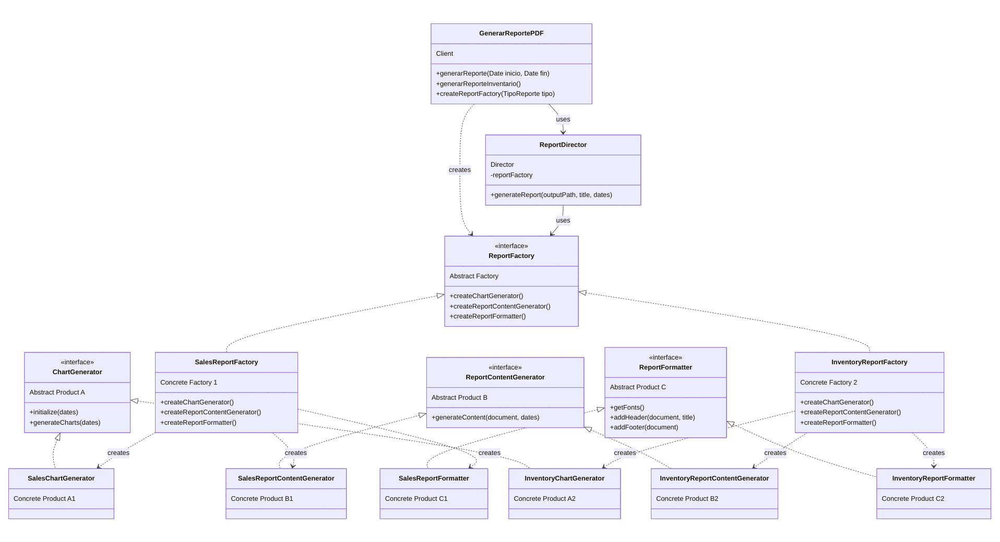

# Patrón Abstract Factory - Sistema de Generación de Reportes

Este directorio contiene la implementación del patrón Abstract Factory para la generación de reportes en el proyecto de la Tienda de Abarrotes.

## Descripción del Patrón

El patrón Abstract Factory proporciona una interfaz para crear familias de objetos relacionados o dependientes sin especificar sus clases concretas. En esta implementación, lo utilizamos para crear diferentes tipos de reportes (ventas, inventario) con componentes consistentes.

## Estructura

### Interfaces (Productos Abstractos)
- `ChartGenerator`: Define la interfaz para crear gráficos para los reportes
- `ReportContentGenerator`: Define la interfaz para generar el contenido del reporte
- `ReportFormatter`: Define la interfaz para formatear los reportes

### Abstract Factory
- `ReportFactory`: La interfaz abstracta de la fábrica que declara métodos para crear componentes de reporte

### Fábricas Concretas
- `SalesReportFactory`: Crea componentes para reportes de ventas
- `InventoryReportFactory`: Crea componentes para reportes de inventario

### Director
- `ReportDirector`: Coordina el proceso de generación de reportes utilizando la fábrica abstracta

## Uso

Para generar un reporte:

```java
// Crear una fábrica de reportes
ReportFactory factory = new SalesReportFactory();

// Crear un director de reportes con la fábrica
ReportDirector director = new ReportDirector(factory);

// Generar un reporte
director.generateReport("output.pdf", "Título del Reporte", fechaInicio, fechaFin);
```

Alternativamente, utilizar la interfaz simplificada en `GenerarReportePDF`:

```java
GenerarReportePDF generador = new GenerarReportePDF();

// Generar un reporte de ventas
generador.generarReporte(fechaInicio, fechaFin);

// Generar un reporte de inventario
generador.generarReporteInventario();
```

## Extensión del Sistema

Para agregar un nuevo tipo de reporte:

1.  Crear una nueva fábrica concreta que implemente la interfaz `ReportFactory`.
2.  Crear las clases concretas para `ChartGenerator`, `ReportContentGenerator` y `ReportFormatter` específicas para el nuevo tipo de reporte.
3.  Modificar la clase `GenerarReportePDF` para incluir la opción de generar el nuevo tipo de reporte.


## Diagrama de clases (simplificado)



## Comparacion

# Comparación: Implementación Original vs. Patrón Abstract Factory

## 1. Estructura del Código

### Implementación Original

La implementación original utilizaba un enfoque monolítico donde todas las responsabilidades estaban concentradas en pocas clases:

- `GenerarReportePDF`: Manejaba toda la lógica de generación de reportes, formateo y contenido
- `ChartGenerator`: Generaba todos los tipos de gráficos
- Sin separación clara entre los diferentes componentes de los reportes

```
GenerarReportePDF
  ├── generarReporte()
  ├── agregarGraficasYDescripciones()
  ├── agregarSeccionConGraficaYDescripcion()
  ├── agregarReporteEmpleado()
  ├── agregarVentasEmpleado()
  ├── agregarProductosVendidosEmpleado()
  └── agregarDesempeñoEmpleado()

ChartGenerator
  ├── initialize()
  ├── crearGraficas()
  ├── generarGraficaVentasPorProducto()
  ├── generarGraficaVentasPorEmpleado()
  └── generarGraficaProductosMenosVendidos()
```

### Nueva Implementación (Abstract Factory)

La nueva implementación separa las responsabilidades en interfaces y clases especializadas:

```
ReportFactory (interfaz)
  ├── SalesReportFactory
  └── InventoryReportFactory

ChartGenerator (interfaz)
  ├── SalesChartGenerator
  └── InventoryChartGenerator

ReportContentGenerator (interfaz)
  ├── SalesReportContentGenerator
  └── InventoryReportContentGenerator

ReportFormatter (interfaz)
  ├── SalesReportFormatter
  └── InventoryReportFormatter

ReportDirector
  └── generateReport()

GenerarReportePDF (simplificado)
  ├── generarReporte()
  └── generarReporteInventario()
```

## 2. Flujo de Ejecución

### Implementación Original

1. `GenerarReportePDF.generarReporte()` crea el documento PDF
2. Llama directamente a métodos internos para agregar cada parte del reporte
3. Crea una instancia de `ChartGenerator` para generar los gráficos
4. Accede directamente a la base de datos para obtener información

```java
// Ejemplo del código original
public void generarReporte(Date fechaInicio, Date fechaFin) {
    Document document = new Document();
    PdfWriter.getInstance(document, new FileOutputStream(rutaArchivo));
    document.open();
    
    // Añadir título principal
    Font fontTitulo = new Font(Font.FontFamily.HELVETICA, 18, Font.BOLD);
    Paragraph titulo = new Paragraph("Reporte de Ventas", fontTitulo);
    document.add(titulo);
    
    // Añadir las gráficas y sus descripciones
    agregarGraficasYDescripciones(document, fechaInicio, fechaFin);
    
    // Obtener los datos de los empleados y sus ventas
    CONSULTASDAO dao = new CONSULTASDAO(Conexion_DB.getConexion());
    List<Usuario> usuarios = dao.obtenerTodosLosUsuarios();
    
    for (Usuario usuario : usuarios) {
        agregarReporteEmpleado(document, dao, usuario, fechaInicio, fechaFin);
    }
    
    document.close();
}
```

### Nueva Implementación (Abstract Factory)

1. `GenerarReportePDF` crea la fábrica apropiada según el tipo de reporte
2. Crea un `ReportDirector` con la fábrica
3. El director coordina la creación del reporte usando los componentes creados por la fábrica

```java
// Ejemplo con el patrón Abstract Factory
public void generarReporte(Date fechaInicio, Date fechaFin) {
    // Crear una fábrica de reportes de ventas
    ReportFactory reportFactory = new SalesReportFactory();
    
    // Crear un director de reportes con la fábrica
    ReportDirector reportDirector = new ReportDirector(reportFactory);
    
    // Generar el reporte de ventas
    reportDirector.generateReport("reportes/reporte_ventas.pdf", 
                                "Reporte de Ventas", 
                                fechaInicio, fechaFin);
}
```

## 3. Comparación de Características

| Característica | Implementación Original | Nueva Implementación |
|----------------|-------------------------|----------------------|
| **Extensibilidad** | Limitada - Agregar nuevos tipos de reportes requiere modificar clases existentes | Alta - Nuevos tipos de reportes pueden agregarse creando nuevas fábricas y componentes |
| **Cohesión** | Baja - Clases con múltiples responsabilidades | Alta - Cada clase tiene una única responsabilidad bien definida |
| **Acoplamiento** | Alto - Dependencias directas entre componentes | Bajo - Dependencias a través de interfaces |
| **Reutilización** | Baja - Código difícil de reutilizar | Alta - Componentes individuales pueden reutilizarse |
| **Mantenibilidad** | Difícil - Cambios en un reporte afectan a otros | Fácil - Cambios aislados a componentes específicos |
| **Complejidad inicial** | Baja - Estructura más simple | Media - Más clases e interfaces |
| **Organización del código** | Baja - Estructura monolítica | Alta - Estructura jerárquica y modular |

## 4. Beneficios de la Nueva Implementación

1. **Mejor organización del código**:
   - Separación clara de responsabilidades
   - Cada componente se enfoca en una tarea específica

2. **Mayor flexibilidad**:
   - Fácil agregar nuevos tipos de reportes
   - Fácil modificar componentes individuales

3. **Mejor mantenibilidad**:
   - Los cambios en un tipo de reporte no afectan a otros
   - Menor riesgo de introducir errores

4. **Conformidad con principios SOLID**:
   - Principio de Responsabilidad Única
   - Principio de Abierto/Cerrado
   - Principio de Inversión de Dependencias

5. **Soporte para futuras extensiones**:
   - Estructura para agregar nuevos tipos de reportes (financieros, administrativos, etc.)
   - Capacidad de reemplazar implementaciones específicas sin afectar el resto del sistema


## 6. Comparacion en tiempo de ejecución

Se puede ver una comparación haciendo logs de la apliacación en la implementación original y la implementación con el patrón Abstract Factory.

[Comparativa de logs](./logs.md)

## 7. Conclusión

La implementación con el patrón Abstract Factory proporciona una arquitectura más robusta, extensible y mantenible a costa de una mayor complejidad inicial. Para un sistema que necesita soportar múltiples tipos de reportes y que probablemente crecerá con el tiempo, los beneficios superan claramente las desventajas.

La nueva implementación facilita:
- Agregar nuevos tipos de reportes
- Modificar el formato o contenido de reportes existentes
- Reutilizar componentes entre diferentes tipos de reportes
- Realizar cambios con menor riesgo de afectar otras partes del sistema