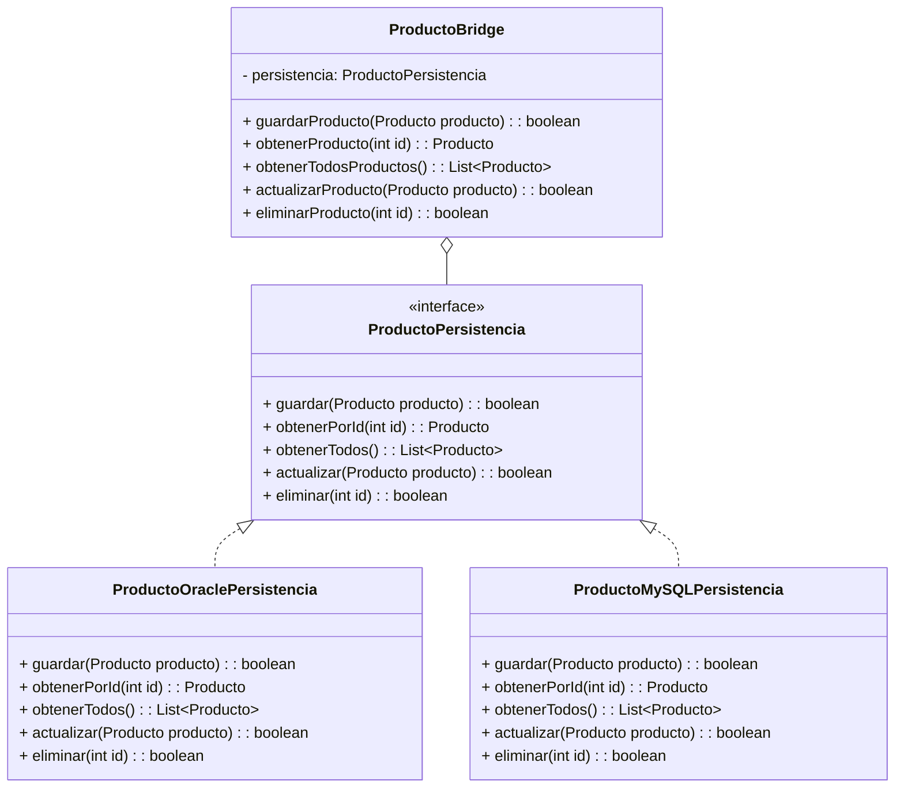

# 🌉 Patrón Bridge: Implementación de Persistencia de Productos

## 🚀 Descripción del Proyecto

Este proyecto demuestra la implementación del Patrón Bridge para la persistencia de productos en diferentes sistemas de bases de datos, permitiendo una abstracción flexible entre la lógica de negocio y las implementaciones específicas de base de datos.

## 🧩 Patrón Bridge: Explicación Conceptual

### ¿Qué es el Patrón Bridge? 🤔

El Patrón Bridge es un patrón de diseño estructural que permite desacoplar una abstracción de su implementación, de modo que ambas puedan variar de forma independiente. En otras palabras, separa una abstracción de su implementación para que puedan cambiar sin afectar mutuamente.

### Beneficios 💡
- Desacoplamiento entre abstracción e implementación
- Mayor flexibilidad en el diseño del sistema
- Facilita la extensión de implementaciones
- Mejora la mantenibilidad del código

## 📐 Diagrama UML



## 🔍 Componentes Clave

### 1. Interfaz `ProductoPersistencia` 📋
- Define los métodos básicos de persistencia
- Actúa como puente entre la lógica de negocio y las implementaciones de base de datos

```java
public interface ProductoPersistencia {
    boolean guardar(Producto producto);
    Producto obtenerPorId(int id);
    List<Producto> obtenerTodos();
    boolean actualizar(Producto producto);
    boolean eliminar(int id);
}
```

### 2. Implementaciones Concretas 🗃️
#### `ProductoOraclePersistencia`
- Implementación específica para bases de datos Oracle
- Maneja la lógica de conexión y operaciones con Oracle

#### `ProductoMySQLPersistencia`
- Implementación específica para bases de datos MySQL
- Maneja la lógica de conexión y operaciones con MySQL

### 3. Clase `ProductoBridge` 🌈
- Actúa como intermediario entre la lógica de negocio y las implementaciones de persistencia
- Delega las operaciones a la implementación específica

```java
public class ProductoBridge {
    protected ProductoPersistencia persistencia;

    public ProductoBridge(ProductoPersistencia persistencia) {
        this.persistencia = persistencia;
    }

    public boolean guardarProducto(Producto producto) {
        return persistencia.guardar(producto);
    }
    // Otros métodos de delegación...
}
```

## 🚦 Flujo de Trabajo

1. Crear un `Producto` usando el Builder
2. Seleccionar la implementación de persistencia (Oracle o MySQL)
3. Crear un `ProductoBridge` con la implementación deseada
4. Realizar operaciones CRUD

```java
// Ejemplo de uso
ProductoPersistencia oraclePersistencia = new ProductoOraclePersistencia();
ProductoBridge oracleBridge = new ProductoBridge(oraclePersistencia);

Producto producto = new Producto.ProductoBuilder()
    .nombre("Tablet Oracle")
    .precio(300.0)
    // ... otros atributos
    .build();

oracleBridge.guardarProducto(producto);
```

## 🌟 Ventajas de esta Implementación

- 🔄 Cambiar de base de datos sin modificar la lógica de negocio
- 🧩 Fácil extensión para nuevos tipos de bases de datos
- 🛡️ Separación clara de responsabilidades
- 📊 Mantenimiento y pruebas más sencillos

## 🔧 Consideraciones Técnicas

- Requiere conexiones de base de datos configuradas
- Manejo de excepciones SQL
- Uso de PreparedStatement para prevenir inyecciones SQL
- Logging para seguimiento de errores

## 📦 Dependencias
- Java 8+
- Drivers JDBC para Oracle y MySQL
- Bibliotecas de logging

## 🚧 Posibles Mejoras
- Implementar caché de resultados
- Añadir más tipos de bases de datos
- Implementar transacciones más robustas
- Añadir validaciones adicionales

## 📝 Contribuciones
¡Las contribuciones son bienvenidas! Por favor, abre un issue o realiza un pull request.

## 📄 Licencia
[Especifica tu licencia aquí]

---

¡Gracias por explorar este ejemplo del Patrón Bridge! 🎉