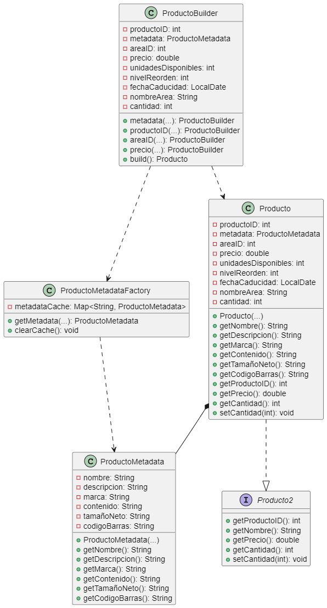

# Implementación del Patrón Flyweight en el Sistema de Ventas

## Objetivo
Optimizar el uso de memoria compartiendo eficientemente datos comunes entre productos mediante el patrón **Flyweight**, mejorando el rendimiento del sistema al reducir la duplicación de información.

## Cambios Realizados

### 1. Nueva Clase `ProductoMetadata` (Flyweight)
Se creó una nueva clase para almacenar los datos compartidos entre productos (estado intrínseco):

```java
public class ProductoMetadata {
    private final String nombre;
    private final String descripcion;
    private final String marca;
    private final String contenido;
    private final String tamañoNeto;
    private final String codigoBarras;
    
    public ProductoMetadata(String nombre, String descripcion, String marca, 
                          String contenido, String tamañoNeto, String codigoBarras) {
        // Inicialización de campos
    }
    
    // Getters para todos los campos
}
```

### 2. Clase `ProductoMetadataFactory` (Flyweight Factory)
Se implementó una factory para gestionar y cachear las instancias de ProductoMetadata:

```java
public class ProductoMetadataFactory {
    private static final Map<String, ProductoMetadata> cache = new HashMap<>();
    
    public static ProductoMetadata getMetadata(String nombre, String descripcion, 
                                            String marca, String contenido, 
                                            String tamañoNeto, String codigoBarras) {
        String key = generarClaveUnica(nombre, codigoBarras);
        return cache.computeIfAbsent(key, 
            k -> new ProductoMetadata(nombre, descripcion, marca, 
                                    contenido, tamañoNeto, codigoBarras));
    }
}
```

### 3. Modificación en la Clase `Producto`
Se adaptó la clase Producto para utilizar el Flyweight:

```java
public class Producto implements Producto2 {
    private final ProductoMetadata metadata; // Datos compartidos
    private double precio;                  // Datos únicos
    private int stock;                      // Datos únicos
    // ... otros campos únicos
    
    public Producto(ProductoMetadata metadata, double precio, int stock, ...) {
        this.metadata = metadata;
        this.precio = precio;
        this.stock = stock;
        // ...
    }
    
    // Los métodos de Producto2 ahora delegan al Flyweight cuando corresponda
    @Override
    public String getNombre() {
        return metadata.getNombre();
    }
    // ... otros métodos
}
```

### 4. Actualización del `ProductoBuilder`
Se modificó el builder para incorporar el uso del Flyweight:

```java
public static class ProductoBuilder {
    private ProductoMetadata metadata;
    // ... otros campos
    
    public ProductoBuilder metadata(String nombre, String descripcion, 
                                  String marca, String contenido, 
                                  String tamañoNeto, String codigoBarras) {
        this.metadata = ProductoMetadataFactory.getMetadata(
            nombre, descripcion, marca, contenido, tamañoNeto, codigoBarras);
        return this;
    }
    
    public Producto build() {
        return new Producto(metadata, precio, stock, ...);
    }
}
```

## Beneficios Obtenidos

1. **Reducción de memoria**: Los datos compartidos (nombre, descripción, marca) se almacenan una sola vez
2. **Consistencia garantizada**: Cambios en datos compartidos afectan a todos los productos relacionados
3. **Mejor rendimiento**: Menos instancias reducen la carga del recolector de basura
4. **Código más limpio**: Separación clara entre datos compartidos y únicos

## Ejemplo de Uso

```java
// Creación de productos compartiendo metadata
Producto leche1 = new Producto.Builder()
    .metadata("Leche Entera", "Leche UHT", "Lala", "1L", "1 litro", "123456")
    .precio(25.50)
    .stock(100)
    .build();

Producto leche2 = new Producto.Builder()
    .metadata("Leche Entera", "Leche UHT", "Lala", "1L", "1 litro", "123456") // Mismo metadata
    .precio(27.50)  // Precio diferente
    .stock(50)      // Stock diferente
    .build();
```

## Diagrama UML


*(Diagrama que muestra las relaciones entre Producto, ProductoMetadata, ProductoMetadataFactory y ProductoBuilder)*