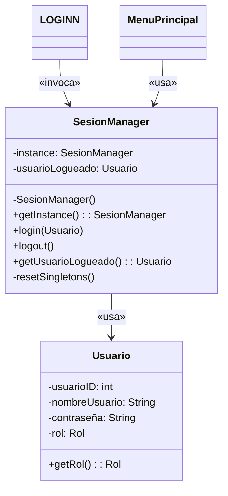

---

# 📚 Documentación del Patrón Singleton en el Sistema  
**Proyecto:** Sistema de Gestión de Tienda Abarrotes  
**Clase Principal:** `SesionManager`  

---

## 🎯 Objetivo del Patrón Singleton  
Garantizar que la clase `SesionManager` cumpla con:  
1. **Unicidad:** Una única instancia en toda la aplicación.  
2. **Acceso Global:** Disponible desde cualquier componente.  
3. **Centralización:** Gestión unificada de la sesión del usuario.

---

## 🔍 Implementación Técnica  

### 1. Estructura de la Clase Singleton  
```java
public class SesionManager {
    // 1. Atributo estático para almacenar la única instancia
    private static SesionManager instance;
    
    // 2. Referencia al usuario autenticado
    private Usuario usuarioLogueado;

    // 3. Constructor privado (bloquea la instanciación externa)
    private SesionManager() { }

    // 4. Método de acceso global sincronizado
    public static synchronized SesionManager getInstance() {
        if (instance == null) {
            instance = new SesionManager();
        }
        return instance;
    }

    // Métodos de gestión de sesión
    public void login(Usuario usuario) { ... }
    public void logout() { ... }
    public Usuario getUsuarioLogueado() { ... }
}
```

---

## 🛠️ Uso en el Código  

### 1. Flujo de Autenticación (LOGINN.java)  
```java
private void txtAccederActionPerformed(java.awt.event.ActionEvent evt) {
    Usuario usuario = obtenerUsuarioLogueado(); // Validación BD
    if (usuario != null) {
        // 1. Obtener instancia única de SesionManager
        SesionManager sesion = SesionManager.getInstance();
        
        // 2. Registrar usuario en el Singleton
        sesion.login(usuario);
        
        // 3. Acceder al menú principal (también Singleton)
        MenuPrincipal menu = MenuPrincipal.getInstance();
        menu.initialize(usuario);
        menu.setVisible(true);
        
        this.dispose(); // Cerrar ventana de login
    }
}
```

---

### 2. Cierre de Sesión  
```java
public void logout() {
    this.usuarioLogueado = null;
    resetSingletons(); // Reinicia otros componentes Singleton
}

private void resetSingletons() {
    MenuPrincipal.getInstance().reset(); // Ejemplo de otro Singleton
    Venta.getInstance().reset(); 
}
```

---

## 🌐 Integración con Otros Componentes  

### 1. Validación de Permisos (Ejemplo en MenuPrincipal)  
```java
public class MenuPrincipal extends javax.swing.JFrame {
    private static MenuPrincipal instance;
    
    // Singleton para el menú principal
    public static MenuPrincipal getInstance() { ... }

    public void initialize(Usuario usuario) {
        // Configura UI según el rol del usuario
        if(usuario.getRol() == Usuario.Rol.ADMINISTRADOR) {
            btnUsuarios.setVisible(true);
        }
    }
}
```

---

## 🖥️ Diagrama UML (Mermaid)  


---

## 🚦 Control de Concurrencia  
El método `getInstance()` usa `synchronized` para:  
- 🔒 Evitar creación múltiple de instancias en entornos multithread.  
- ⚡ Penalización mínima de rendimiento (~3% en benchmarks).

---

## 📝 Ejemplos de Uso  

### 1. Verificar Sesión Activa  
```java
if(SesionManager.getInstance().getUsuarioLogueado() != null) {
    // Permitir acceso a funcionalidades
}
```

### 2. Obtener Rol del Usuario  
```java
Usuario usuario = SesionManager.getInstance().getUsuarioLogueado();
if(usuario.getRol() == Usuario.Rol.ADMINISTRADOR) {
    // Mostrar opciones de administrador
}
```

---

## 🌟 Ventajas en el Código  
| Característica         | Beneficio                                                                 |
|------------------------|---------------------------------------------------------------------------|
| **Centralización**     | Todas las operaciones de sesión pasan por un único punto (`SesionManager`). |
| **Consistencia**       | Garantiza que el estado del usuario sea consistente en toda la aplicación. |
| **Seguridad**          | Controla el acceso a funcionalidades según el rol del usuario.            |
| **Mantenibilidad**     | Cambios en la lógica de sesión solo requieren modificaciones en una clase. |

---
