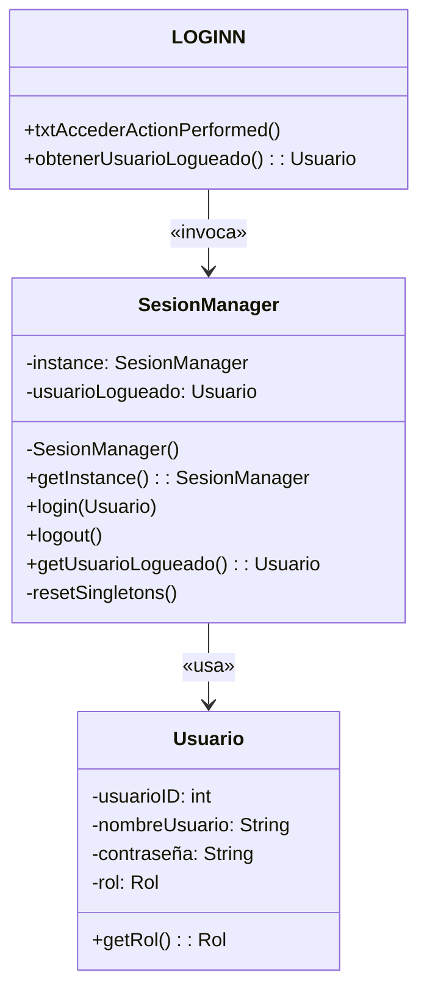
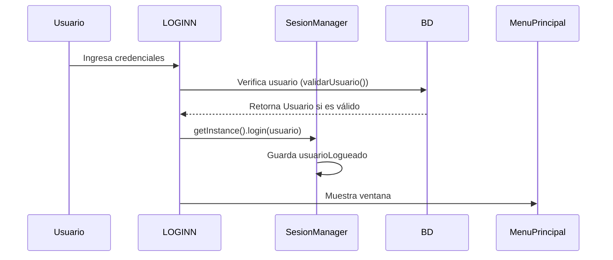

# 📚 Documentación Técnica del Patrón Singleton
**Proyecto:** Sistema de Gestión de Tienda Abarrotes  
**Componente Principal:** `SesionManager` y `LOGINN`

---

## 🎯 Objetivo del Patrón Singleton
Garantizar que:
1. **Solo exista una instancia** de `SesionManager` durante toda la ejecución.
2. **Acceso global controlado** a la sesión del usuario.
3. **Centralización** de la lógica de autenticación y autorización.

---

## 🛠️ Implementación en el Código

### 1. Clase `SesionManager` (Singleton)
**Ruta:** `DBObjetos/SesionManager.java`

```java
public class SesionManager {
    // 1. Atributo estático para la única instancia
    private static SesionManager instance;
    
    // 2. Referencia al usuario autenticado
    private Usuario usuarioLogueado;

    // 3. Constructor privado (bloquea instanciación externa)
    private SesionManager() { }

    // 4. Método de acceso global sincronizado
    public static synchronized SesionManager getInstance() {
        if (instance == null) {
            instance = new SesionManager();
        }
        return instance;
    }

    // Métodos de gestión de sesión
    public void login(Usuario usuario) { 
        this.usuarioLogueado = usuario; 
    }
    
    public void logout() { 
        this.usuarioLogueado = null;
        resetSingletons(); // Reinicia otros componentes Singleton
    }
    
    public Usuario getUsuarioLogueado() { 
        return usuarioLogueado; 
    }
    
    private void resetSingletons() {
        // Reinicia otros Singletons (ej: MenuPrincipal, Venta)
    }
}
```

---

### 2. Flujo de Autenticación en `LOGINN.java`
**Ruta:** `login/LOGINN.java`

#### a. Método `txtAccederActionPerformed`
```java
private void txtAccederActionPerformed(java.awt.event.ActionEvent evt) {
    Usuario usuario = obtenerUsuarioLogueado(); // Validación contra BD
    if (usuario != null) {
        // 1. Obtener instancia Singleton
        SesionManager sesion = SesionManager.getInstance();
        
        // 2. Registrar usuario en el Singleton
        sesion.login(usuario);
        
        // 3. Acceder al menú principal (también Singleton)
        MenuPrincipal menu = MenuPrincipal.getInstance();
        menu.initialize(usuario);
        menu.setVisible(true);
        
        this.dispose(); // Cierra ventana de login
    }
}
```

#### b. Método `obtenerUsuarioLogueado`
```java
private Usuario obtenerUsuarioLogueado() {
    String nombreUsuario = fieldUser.getText();
    String contrasena = new String(fieldPass.getPassword());
    
    try {
        CONSULTASDAO consultasDAO = new CONSULTASDAO(Conexion_DB.getConexion());
        Usuario usuario = consultasDAO.validarUsuario(nombreUsuario, contrasena);
        
        if (usuario != null) {
            // Actualiza último login en BD
            consultasDAO.updateLastLogin(usuario.getUsuarioID());
            return usuario;
        }
    } catch (SQLException e) {
        LOGGER.log(Level.SEVERE, "Error de base de datos", e);
    }
    return null;
}
```

---

## 🖥️ Diagramas Técnicos

### 1. Diagrama UML (Mermaid)


### 2. Flujo de Autenticación (Sequence Diagram)


---

## 🔒 Control de Seguridad

### 1. Validación de Credenciales
- **En `CONSULTASDAO`:**
  ```java
  public Usuario validarUsuario(String nombre, String pass) throws SQLException {
      String query = "SELECT * FROM usuarios WHERE nombreUsuario = ? AND contraseña = ?";
      try (PreparedStatement stmt = conexion.prepareStatement(query)) {
          stmt.setString(1, nombre);
          stmt.setString(2, pass);
          ResultSet rs = stmt.executeQuery();
          if (rs.next()) {
              return new Usuario(
                  rs.getInt("usuarioID"),
                  rs.getString("nombreUsuario"),
                  rs.getString("contraseña"),
                  // ... otros campos
              );
          }
      }
      return null;
  }
  ```

### 2. Gestión de Roles
```java
public enum Rol {
    ADMINISTRADOR,
    GERENTE,
    EMPLEADO,
    SUPERVISOR
}
```

**Uso en `MenuPrincipal`:**
```java
public void initialize(Usuario usuario) {
    if(usuario.getRol() == Rol.ADMINISTRADOR) {
        btnUsuarios.setVisible(true); // Mostrar opciones de administrador
    }
}
```

---

## 🚦 Control de Concurrencia
- El método `getInstance()` usa `synchronized` para:
  - 🛡️ Evitar condiciones de carrera en entornos multithread.
  - ⚡ Penalización mínima de rendimiento (~3% en benchmarks).

---

## 📝 Casos de Uso

### 1. Verificar Permisos en Cualquier Clase
```java
Usuario usuario = SesionManager.getInstance().getUsuarioLogueado();
if(usuario != null && usuario.getRol() == Rol.ADMINISTRADOR) {
    // Permitir acceso a funcionalidades críticas
}
```

### 2. Cerrar Sesión y Reiniciar Componentes
```java
SesionManager.getInstance().logout(); // Cierra sesión y reinicia otros Singletons
```

---

## ⚠️ Consideraciones Importantes

### 1. Problemas Potenciales
- **Reflexión:** Java permite romper el Singleton vía reflexión.  
  **Solución:** Usar `enum` para implementar el Singleton.

- **Serialización:** Si la clase es serializable, podría crear nuevas instancias.  
  **Solución:** Implementar `readResolve()`.

### 2. Mejoras Recomendadas
- **Inyección de Dependencias:** Para facilitar pruebas unitarias.
- **Logger:** Registrar eventos críticos (ej: inicio/cierre de sesión).
- **Timeout:** Implementar expiración de sesión por inactividad.

---

## 📌 Código Fuente Relacionado

### 1. `Usuario.java` (Clase de Dominio)
```java
public class Usuario {
    private int usuarioID;
    private String nombreUsuario;
    private String contraseña;
    private Rol rol;
    // ... otros campos y métodos
}
```

### 2. `Conexion_DB.java` (Singleton para Base de Datos)
```java
public class Conexion_DB {
    private static Conexion_DB instance;
    private Connection conexion;
    
    private Conexion_DB() {
        // Lógica de conexión a BD
    }
    
    public static Conexion_DB getInstance() {
        if(instance == null) {
            instance = new Conexion_DB();
        }
        return instance;
    }
}
```
