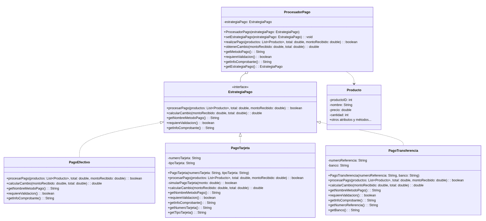

# Patrón Strategy en Tienda de Abarrotes

## ¿Qué es el Patrón Strategy?

El Patrón Strategy es un patrón de diseño comportamental que permite definir una familia de algoritmos, encapsular cada uno y hacerlos intercambiables. Este patrón permite que el algoritmo varíe independientemente de los clientes que lo utilizan.

## Problema que resuelve

En el sistema de la tienda de abarrotes, tenemos la necesidad de manejar diferentes métodos de pago como:
- Pago en efectivo
- Pago con tarjeta (crédito o débito)
- Pago por transferencia bancaria

Cada uno de estos métodos tiene comportamientos diferentes:
- Diferentes validaciones de pago
- Diferentes maneras de calcular cambios o comisiones
- Diferentes datos requeridos para el comprobante

Si implementáramos esta lógica con condicionales dentro de la clase de Cobro, tendríamos un código difícil de mantener y extender. Cada vez que quisiéramos agregar un nuevo método de pago, necesitaríamos modificar la clase existente, lo cual viola el principio "Open/Closed" de SOLID.

## Solución con el Patrón Strategy

Implementamos el patrón Strategy para encapsular cada método de pago como una estrategia independiente:

1. **Interfaz `EstrategiaPago`**: Define el contrato que deben implementar todas las estrategias de pago.
2. **Clases concretas de estrategia**:
   - `PagoEfectivo`: Implementa la lógica para pagos en efectivo.
   - `PagoTarjeta`: Implementa la lógica para pagos con tarjeta.
   - `PagoTransferencia`: Implementa la lógica para pagos por transferencia.
3. **Clase contexto `ProcesadorPago`**: Utiliza una estrategia de pago y delega en ella las operaciones relacionadas con el pago.

## Diagrama UML de la implementación



## Beneficios de la implementación

1. **Flexibilidad**: Podemos cambiar el comportamiento del sistema en tiempo de ejecución simplemente cambiando la estrategia utilizada.
2. **Extensibilidad**: Podemos añadir nuevos métodos de pago creando nuevas clases que implementen la interfaz `EstrategiaPago`, sin modificar el código existente.
3. **Mantenibilidad**: El código está mejor organizado y cada clase tiene una única responsabilidad.
4. **Código abierto-cerrado**: Cumple con el principio Open/Closed, ya que podemos extender el sistema sin modificar el código existente.

## Cómo utilizar el patrón en la aplicación

Para utilizar el patrón Strategy en el sistema de la tienda de abarrotes:

1. Crea una instancia de `ProcesadorPago` con la estrategia de pago inicial.
2. Cuando el usuario seleccione un método de pago, cambia la estrategia en el procesador usando `setEstrategiaPago()`.
3. Utiliza el método `realizarPago()` del procesador para efectuar el pago.
4. Obtén el cambio e información para el comprobante usando los métodos correspondientes.

## Ejemplo de uso

En la clase `DemoStrategy` se muestra un ejemplo de cómo utilizar el patrón Strategy en acción, procesando pagos con diferentes métodos y mostrando los resultados.

Para ejecutar la demostración:

```java
java -cp . strategy.DemoStrategy
```

## Conclusión

El patrón Strategy permite desacoplar los algoritmos de su contexto de uso, facilitando la extensión y mantenimiento del sistema. En el caso de la tienda de abarrotes, hemos logrado crear un sistema de pago flexible y fácil de extender, que puede adaptarse a los requisitos cambiantes del negocio.
